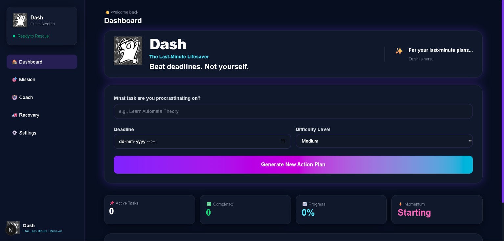
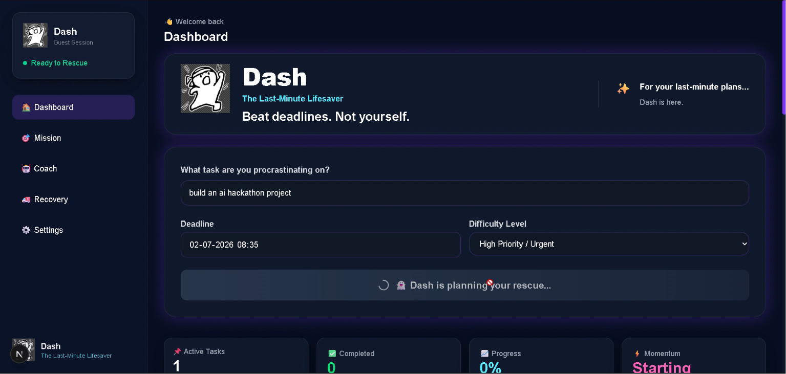
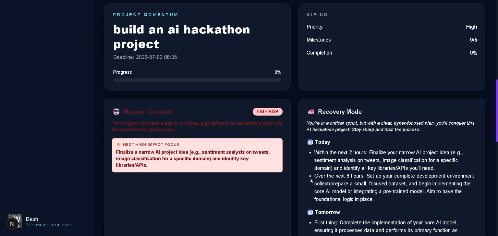
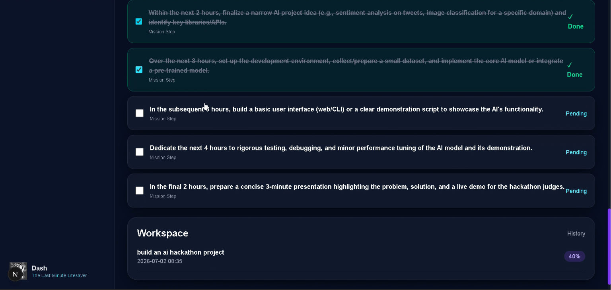
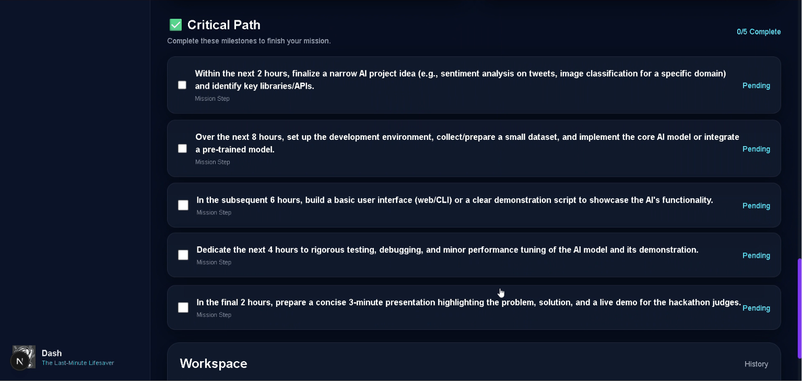
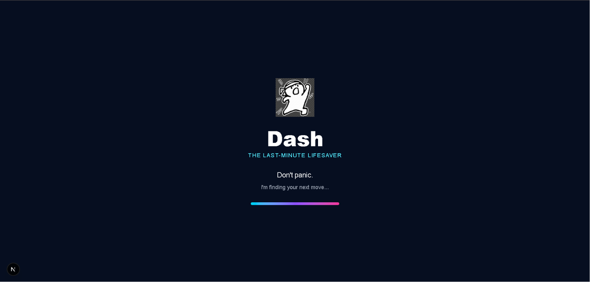

# Dash

### The Last-Minute Lifesaver

An AI-powered productivity assistant that transforms overwhelming deadlines into clear, actionable rescue plans.

Built for students, developers, and anyone who's ever stared at a deadline wondering:

> **"Where do I even start?"**

---

## ✨ Overview

Dash uses **Google Gemini AI** to analyze a user's task, deadline, and difficulty level, then generates an intelligent execution plan complete with:

- 🎯 Priority Assessment
- 📝 Actionable Subtasks
- 🤖 AI Productivity Coach
- 🚑 Recovery Planner
- 📈 Real-Time Progress Tracking

Instead of giving generic advice, Dash breaks overwhelming work into realistic, achievable steps so users always know what to do next.

---
## 🌐 Live Demo

**Frontend**
https://dash-frontend-526477031025.asia-south1.run.app

**Backend API**
https://dash-backend-526477031025.asia-south1.run.app

**API Documentation**
https://dash-backend-526477031025.asia-south1.run.app/docs

---
## 🚀 Features

- 🧠 AI-powered task planning using Google Gemini
- ⚡ Intelligent priority detection
- 📅 Deadline-aware action plans
- ✅ Interactive task & subtask tracking
- 📈 Live progress monitoring
- 🤖 AI Productivity Coach with contextual guidance
- 🚑 AI Recovery Planner for missed deadlines
- 🎨 Modern glassmorphism dashboard
- 🌙 Dark mode interface
- 📱 Responsive design

---

## 📸 Screenshots

### 🏠 Home



---

### 🤖 AI Dashboard




---

### 🚑 Recovery Mode



---

### ✅ Critical Path



---

### 👻 Splash Screen



---

## 🛠️ Tech Stack

### Frontend

- Next.js
- React
- TypeScript
- Tailwind CSS

### Backend

- FastAPI
- Python

### AI

- Google Gemini 2.5 Flash API

### Database

- SQLite

### Version Control

- Git & GitHub

---

## 🏗️ Architecture

```text
            User
              │
              ▼
      Next.js Frontend
              │
              ▼
       FastAPI Backend
              │
      ┌───────┴────────┐
      ▼                ▼
 Google Gemini      SQLite
      │
      ▼
 AI-generated Rescue Plan
```

## ⚙️ Installation

### 1. Clone the repository

```bash
git clone https://github.com/YOUR_USERNAME/last-minute-lifesaver.git
cd last-minute-lifesaver
```

### 2. Backend Setup

```bash
cd backend
python -m venv venv
venv\Scripts\activate
pip install -r requirements.txt
uvicorn main:app --reload
```

### 3. Frontend Setup

```bash
cd frontend
npm install
npm run dev
```

The application will run at:

- Frontend → http://localhost:3000
- Backend → http://localhost:8000

---

## 🔑 Google Gemini API Setup

Create a `.env` file inside the `backend` folder and add:

```env
GEMINI_API_KEY=YOUR_API_KEY
```

You can generate an API key from Google AI Studio.

---

## 📂 Project Structure

```text
last-minute-lifesaver/
│
├── backend/
│   ├── main.py
│   ├── lifesaver.db
│   └── ...
│
├── frontend/
│   ├── src/
│   ├── public/
│   └── ...
│
└── README.md
```

---

## 🌱 Future Improvements

- 📅 Calendar integration
- 📧 Email and notification reminders
- 👥 Team collaboration
- 📊 Productivity analytics
- 🎙️ Voice-based AI assistant
- ☁️ Cloud synchronization

---

## 📄 License

This project was developed for hackathon and is intended for educational and demonstration purposes.
